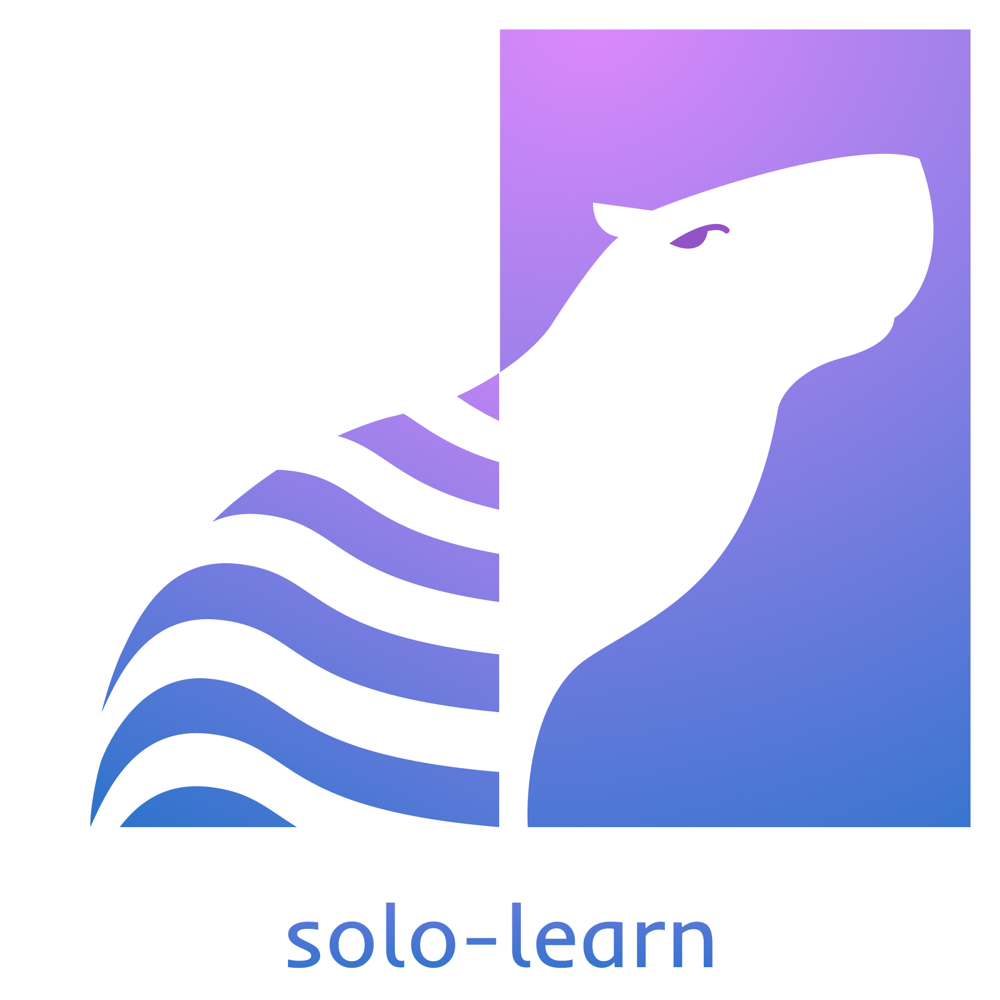

<p align="center">
  
</p>

<div align="center">

[](https://github.com/vturrisi/solo-learn/actions/workflows/tests.yml)
[](https://solo-learn.readthedocs.io/en/latest/?badge=latest)
[](https://codecov.io/gh/vturrisi/solo-learn)

</div>

# solo-learn
A library of self-supervised methods for unsupervised visual representation learning powered by PyTorch Lightning.
We aim at providing SOTA self-supervised methods in a comparable environment while, at the same time, implementing training tricks.
The library is self-contained, but it is possible to use the models outside of solo-learn. **More details in our [paper](#citation)**.

---

## News
* **[Jan 07 2023]**: :diving_mask: Added results, checkpoints and configs for MAE on ImageNet. Thanks to [HuangChiEn](https://github.com/HuangChiEn).
* **[Dec 31 2022]**: :stars: Shiny new logo! Huge thanks to [Luiz](https://www.instagram.com/linhaaspera/)!
* **[Sep 27 2022]**: :pencil: Brand new config system using OmegaConf/Hydra. Adds more clarity and flexibility. New tutorials will follow soon!
* **[Aug 04 2022]**: :paintbrush: Added [MAE](https://arxiv.org/abs/2111.06377) and supports finetuning the backbone with `main_linear.py`, mixup, cutmix and [random augment](https://arxiv.org/abs/1909.13719).
* **[Jul 13 2022]**: :sparkling_heart: Added support for [H5](https://docs.h5py.org/en/stable/index.html) data, improved scripts and data handling.
* **[Jun 26 2022]**: :fire: Added [MoCo V3](https://arxiv.org/abs/2104.02057).
* **[Jun 10 2022]**: :bomb: Improved LARS.
* **[Jun 09 2022]**: :lollipop: Added support for [WideResnet](https://arxiv.org/abs/1605.07146), multicrop for SwAV and equalization data augmentation.
* **[May 02 2022]**: :diamond_shape_with_a_dot_inside: Wrapped Dali with a DataModule, added auto resume for linear eval and Wandb run resume.
* **[Apr 12 2022]**: :rainbow: Improved design of models and added support to train with a fraction of data.
* **[Apr 01 2022]**: :mag: Added the option to use [channel last conversion](https://pytorch.org/tutorials/intermediate/memory_format_tutorial.html#converting-existing-models) which considerably decreases training times.
* **[Feb 04 2022]**: :partying_face: Paper got accepted to JMLR.
* **[Jan 31 2022]**: :eye: Added ConvNeXt support with timm.
* **[Dec 20 2021]**: :thermometer: Added ImageNet results, scripts and checkpoints for MoCo V2+.
* **[Dec 05 2021]**: :notes: Separated [SupCon](https://arxiv.org/abs/2004.11362) from SimCLR and added runs.
* **[Dec 01 2021]**: :fountain: Added [PoolFormer](https://arxiv.org/abs/2111.11418).
* **[Nov 29 2021]**: :bangbang: Breaking changes! Update your versions!!!
* **[Nov 29 2021]**: :book: New tutorials!
* **[Nov 29 2021]**: :houses: Added offline K-NN and offline UMAP.
* **[Nov 29 2021]**: :rotating_light: Updated PyTorch and PyTorch Lightning versions. 10% faster.
* **[Nov 29 2021]**: :beers: Added code of conduct, contribution instructions, issue templates and UMAP tutorial.
* **[Nov 23 2021]**: :space_invader: Added [VIbCReg](https://arxiv.org/abs/2109.00783).
* **[Oct 21 2021]**: :triumph: Added support for object recognition via Detectron v2 and auto resume functionally that automatically tries to resume an experiment that crashed/reached a timeout.
* **[Oct 10 2021]**: :japanese_ogre: Restructured augmentation pipelines to allow more flexibility and multicrop. Also added multicrop for BYOL.
* **[Sep 27 2021]**: :pizza: Added [NNSiam](https://arxiv.org/abs/2104.14548), [NNBYOL](https://arxiv.org/abs/2104.14548), new tutorials for implementing new methods [1](https://solo-learn.readthedocs.io/en/latest/tutorials/add_new_method.html) and [2](https://solo-learn.readthedocs.io/en/latest/tutorials/add_new_method_momentum.html), more testing and fixed issues with custom data and linear evaluation.
* **[Sep 19 2021]**: :kangaroo: Added online k-NN evaluation.
* **[Sep 17 2021]**: :robot: Added [ViT](https://arxiv.org/abs/2010.11929) and [Swin](https://arxiv.org/abs/2103.14030).
* **[Sep 13 2021]**: :book: Improved [Docs](https://solo-learn.readthedocs.io/en/latest/?badge=latest) and added tutorials for [pretraining](https://solo-learn.readthedocs.io/en/latest/tutorials/overview.html) and [offline linear eval](https://solo-learn.readthedocs.io/en/latest/tutorials/offline_linear_eval.html).
* **[Aug 13 2021]**: :whale: [DeepCluster V2](https://arxiv.org/abs/2006.09882) is now available.

---

## Roadmap and help needed
* Redoing the documentation to improve clarity.
* Better and up-to-date tutorials.
* Add performance-related testing to ensure that methods perform the same across updates.
* Adding new methods (continuous effort).

---

## Methods available
* [Barlow Twins](https://arxiv.org/abs/2103.03230)
* [BYOL](https://arxiv.org/abs/2006.07733)
* [DeepCluster V2](https://arxiv.org/abs/2006.09882)
* [DINO](https://arxiv.org/abs/2104.14294)
* [MAE](https://arxiv.org/abs/2111.06377)
* [MoCo V2+](https://arxiv.org/abs/2003.04297)
* [MoCo V3](https://arxiv.org/abs/2104.02057)
* [NNBYOL](https://arxiv.org/abs/2104.14548)
* [NNCLR](https://arxiv.org/abs/2104.14548)
* [NNSiam](https://arxiv.org/abs/2104.14548)
* [ReSSL](https://arxiv.org/abs/2107.09282)
* [SimCLR](https://arxiv.org/abs/2002.05709)
* [SimSiam](https://arxiv.org/abs/2011.10566)
* [Supervised Contrastive Learning](https://arxiv.org/abs/2004.11362)
* [SwAV](https://arxiv.org/abs/2006.09882)
* [VIbCReg](https://arxiv.org/abs/2109.00783)
* [VICReg](https://arxiv.org/abs/2105.04906)
* [W-MSE](https://arxiv.org/abs/2007.06346)

---

## Extra flavor

### Backbones
* [ResNet](https://arxiv.org/abs/1512.03385)
* [WideResNet](https://arxiv.org/abs/1605.07146)
* [ViT](https://arxiv.org/abs/2010.11929)
* [Swin](https://arxiv.org/abs/2103.14030)
* [PoolFormer](https://arxiv.org/abs/2111.11418)
* [ConvNeXt](https://arxiv.org/abs/2201.03545)

### Data
* Increased data processing speed by up to 100% using [Nvidia Dali](https://github.com/NVIDIA/DALI).
* Flexible augmentations.

### Evaluation
* Online linear evaluation via stop-gradient for easier debugging and prototyping (optionally available for the momentum backbone as well).
* Standard offline linear evaluation.
* Online and offline K-NN evaluation.
* Automatic feature space visualization with UMAP.

### Training tricks
* All the perks of PyTorch Lightning (mixed precision, gradient accumulation, clipping, and much more).
* Channel last conversion
* Multi-cropping dataloading following [SwAV](https://arxiv.org/abs/2006.09882):
    * **Note**: currently, only SimCLR, BYOL and SwAV support this.
* Exclude batchnorm and biases from weight decay and LARS.
* No LR scheduler for the projection head (as in SimSiam).

### Logging
* Metric logging on the cloud with [WandB](https://wandb.ai/site)
* Custom model checkpointing with a simple file organization.

---
## Requirements
* torch
* torchvision
* tqdm
* einops
* wandb
* pytorch-lightning
* lightning-bolts
* torchmetrics
* scipy
* timm

**Optional**:
* nvidia-dali
* matplotlib
* seaborn
* pandas
* umap-learn

---

## Installation

First clone the repo.

Then, to install solo-learn with [Dali](https://github.com/NVIDIA/DALI) and/or UMAP support, use:
```
pip3 install .[dali,umap,h5] --extra-index-url https://developer.download.nvidia.com/compute/redist
```

If no Dali/UMAP/H5 support is needed, the repository can be installed as:
```
pip3 install .
```

For local development:
```
pip3 install -e .[umap,h5]
# Make sure you have pre-commit hooks installed
pre-commit install
```

**NOTE:** if you are having trouble with dali, install it following their [guide](https://github.com/NVIDIA/DALI).

**NOTE 2:** consider installing [Pillow-SIMD](https://github.com/uploadcare/pillow-simd) for better loading times when not using Dali.

**NOTE 3:** Soon to be on pip.

---

## Training

For pretraining the backbone, follow one of the many bash files in `scripts/pretrain/`.
We are now using [Hydra](https://github.com/facebookresearch/hydra) to handle the config files, so the common syntax is something like:
```bash
python3 main_pretrain.py \
    # path to training script folder
    --config-path scripts/pretrain/imagenet-100/ \
    # training config name
    --config-name barlow.yaml
    # add new arguments (e.g. those not defined in the yaml files)
    # by doing ++new_argument=VALUE
    # pytorch lightning's arguments can be added here as well.
```

After that, for offline linear evaluation, follow the examples in `scripts/linear` or `scripts/finetune` for finetuning the whole backbone.

For k-NN evaluation and UMAP visualization check the scripts in `scripts/{knn,umap}`.

**NOTE:** Files try to be up-to-date and follow as closely as possible the recommended parameters of each paper, but check them before running.

---

## Tutorials

Please, check out our [documentation](https://solo-learn.readthedocs.io/en/latest) and tutorials:
* [Overview](https://solo-learn.readthedocs.io/en/latest/tutorials/overview.html)
* [Offline linear eval](https://solo-learn.readthedocs.io/en/latest/tutorials/offline_linear_eval.html)
* [Object detection](https://github.com/vturrisi/solo-learn/blob/main/downstream/object_detection/README.md)
* [Adding a new method](https://github.com/vturrisi/solo-learn/blob/main/docs/source/tutorials/add_new_method.rst)
* [Adding a new momentum method](https://github.com/vturrisi/solo-learn/blob/main/docs/source/tutorials/add_new_method_momentum.rst)
* [Visualizing features with UMAP](https://github.com/vturrisi/solo-learn/blob/main/docs/source/tutorials/umap.rst)
* [Offline k-NN](https://github.com/vturrisi/solo-learn/blob/main/docs/source/tutorials/knn.rst)

If you want to contribute to solo-learn, make sure you take a look at [how to contribute](https://github.com/vturrisi/solo-learn/blob/main/.github/CONTRIBUTING.md) and follow the [code of conduct](https://github.com/vturrisi/solo-learn/blob/main/.github/CODE_OF_CONDUCT.md)

---

## Model Zoo

All pretrained models avaiable can be downloaded directly via the tables below or programmatically by running one of the following scripts
`zoo/cifar10.sh`, `zoo/cifar100.sh`, `zoo/imagenet100.sh` and `zoo/imagenet.sh`.

---

## Results

**Note:** hyperparameters may not be the best, we will be re-running the methods with lower performance eventually.

### CIFAR-10

| Method       | Backbone | Epochs | Dali | Acc@1 | Acc@5 | Checkpoint |
|--------------|:--------:|:------:|:----:|:--------------:|:--------------:|:----------:|
| Barlow Twins | ResNet18 |  1000  |  :x: |      92.10     |     99.73      | [:link:](https://drive.google.com/drive/folders/1L5RAM3lCSViD2zEqLtC-GQKVw6mxtxJ_?usp=sharing) |
| BYOL         | ResNet18 |  1000  |  :x: |      92.58     |     99.79      | [:link:](https://drive.google.com/drive/folders/1KxeYAEE7Ev9kdFFhXWkPZhG-ya3_UwGP?usp=sharing) |
|DeepCluster V2| ResNet18 |  1000  |  :x: |      88.85     |     99.58      | [:link:](https://drive.google.com/drive/folders/1tkEbiDQ38vZaQUsT6_vEpxbDxSUAGwF-?usp=sharing) |
| DINO         | ResNet18 |  1000  |  :x: |      89.52     |     99.71      | [:link:](https://drive.google.com/drive/folders/1vyqZKUyP8sQyEyf2cqonxlGMbQC-D1Gi?usp=sharing) |
| MoCo V2+     | ResNet18 |  1000  |  :x: |      92.94     |     99.79      | [:link:](https://drive.google.com/drive/folders/1ruNFEB3F-Otxv2Y0p62wrjA4v5Fr2cKC?usp=sharing) |
| MoCo V3      | ResNet18 |  1000  |  :x: |      93.10     |     99.80      | [:link:](https://drive.google.com/drive/folders/1KwZTshNEpmqnYJcmyYPvfIJ_DNwqtAVj?usp=sharing) |
| NNCLR        | ResNet18 |  1000  |  :x: |      91.88     |     99.78      | [:link:](https://drive.google.com/drive/folders/1xdCzhvRehPmxinphuiZqFlfBwfwWDcLh?usp=sharing) |
| ReSSL        | ResNet18 |  1000  |  :x: |      90.63     |     99.62      | [:link:](https://drive.google.com/drive/folders/1jrFcztY2eO_fG98xPshqOD15pDIhLXp-?usp=sharing) |
| SimCLR       | ResNet18 |  1000  |  :x: |      90.74     |     99.75      | [:link:](https://drive.google.com/drive/folders/1mcvWr8P2WNJZ7TVpdLHA_Q91q4VK3y8O?usp=sharing) |
| Simsiam      | ResNet18 |  1000  |  :x: |      90.51     |     99.72      | [:link:](https://drive.google.com/drive/folders/1OO_igM3IK5oDw7GjQTNmdfg2I1DH3xOk?usp=sharing) |
| SupCon       | ResNet18 |  1000  |  :x: |      93.82     |     99.65      | [:link:](https://drive.google.com/drive/folders/1VwZ9TrJXCpnxyo7P_l397yGrGH-DAUv-?usp=sharing) |
| SwAV         | ResNet18 |  1000  |  :x: |      89.17     |     99.68      | [:link:](https://drive.google.com/drive/folders/1nlJH4Ljm8-5fOIeAaKppQT6gtsmmW1T0?usp=sharing) |
| VIbCReg      | ResNet18 |  1000  |  :x: |      91.18     |     99.74      | [:link:](https://drive.google.com/drive/folders/1XvxUOnLPZlC_-OkeuO7VqXT7z9_tNVk7?usp=sharing) |
| VICReg       | ResNet18 |  1000  |  :x: |      92.07     |     99.74      | [:link:](https://drive.google.com/drive/folders/159ZgCxocB7aaHxwNDubnAWU71zXV9hn-?usp=sharing) |
| W-MSE        | ResNet18 |  1000  |  :x: |      88.67     |     99.68      | [:link:](https://drive.google.com/drive/folders/1xPCiULzQ4JCmhrTsbxBp9S2jRZ01KiVM?usp=sharing) |


### CIFAR-100

| Method       | Backbone | Epochs | Dali | Acc@1 | Acc@5 | Checkpoint |
|--------------|:--------:|:------:|:----:|:--------------:|:--------------:|:----------:|
| Barlow Twins | ResNet18 |  1000  |  :x: |      70.90     |     91.91      | [:link:](https://drive.google.com/drive/folders/1hDLSApF3zSMAKco1Ck4DMjyNxhsIR2yq?usp=sharing) |
| BYOL         | ResNet18 |  1000  |  :x: |      70.46     |     91.96      | [:link:](https://drive.google.com/drive/folders/1hwsEdsfsUulD2tAwa4epKK9pkSuvFv6m?usp=sharing) |
|DeepCluster V2| ResNet18 |  1000  |  :x: |      63.61     |     88.09      | [:link:](https://drive.google.com/drive/folders/1gAKyMz41mvGh1BBOYdc_xu6JPSkKlWqK?usp=sharing) |
| DINO         | ResNet18 |  1000  |  :x: |      66.76     |     90.34      | [:link:](https://drive.google.com/drive/folders/1TxeZi2YLprDDtbt_y5m29t4euroWr1Fy?usp=sharing) |
| MoCo V2+     | ResNet18 |  1000  |  :x: |      69.89     |     91.65      | [:link:](https://drive.google.com/drive/folders/15oWNM16vO6YVYmk_yOmw2XUrFivRXam4?usp=sharing) |
| MoCo V3      | ResNet18 |  1000  |  :x: |      68.83     |     90.57      | [:link:](https://drive.google.com/drive/folders/1Hcf9kMIADKydfxvXLquY9nv7sfNaJ3v6?usp=sharing) |
| NNCLR        | ResNet18 |  1000  |  :x: |      69.62     |     91.52      | [:link:](https://drive.google.com/drive/folders/1Dz72o0-5hugYPW1kCCQDBb0Xi3kzMLzu?usp=sharing) |
| ReSSL        | ResNet18 |  1000  |  :x: |      65.92     |     89.73      | [:link:](https://drive.google.com/drive/folders/1aVZs9cHAu6Ccz8ILyWkp6NhTsJGBGfjr?usp=sharing) |
| SimCLR       | ResNet18 |  1000  |  :x: |      65.78     |     89.04      | [:link:](https://drive.google.com/drive/folders/13pGPcOO9Y3rBoeRVWARgbMFEp8OXxZa0?usp=sharing) |
| Simsiam      | ResNet18 |  1000  |  :x: |      66.04     |     89.62      | [:link:](https://drive.google.com/drive/folders/1AJUPmsIHh_nqEcFe-Vcz2o4ruEibFHWO?usp=sharing) |
| SupCon       | ResNet18 |  1000  |  :x: |      70.38     |     89.57      | [:link:](https://drive.google.com/drive/folders/15C68oHPDMAOPtmBAm_Xw6YI6GgOW00gM?usp=sharing) |
| SwAV         | ResNet18 |  1000  |  :x: |      64.88     |     88.78      | [:link:](https://drive.google.com/drive/folders/1U_bmyhlPEN941hbx0SdRGOT4ivCarQB9?usp=sharing) |
| VIbCReg      | ResNet18 |  1000  |  :x: |      67.37     |     90.07      | [:link:](https://drive.google.com/drive/folders/19u3p1maX3xqwoCHNrqSDb98J5fRvd_6v?usp=sharing) |
| VICReg       | ResNet18 |  1000  |  :x: |      68.54     |     90.83      | [:link:](https://drive.google.com/drive/folders/1AHmVf_Zl5fikkmR4X3NWlmMOnRzfv0aT?usp=sharing) |
| W-MSE        | ResNet18 |  1000  |  :x: |      61.33     |     87.26      | [:link:](https://drive.google.com/drive/folders/1vc9j3RLpVCbECh6o-44oMiE5snNyKPlF?usp=sharing) |

### ImageNet-100

| Method                  | Backbone | Epochs |        Dali        | Acc@1 (online) | Acc@1 (offline) | Acc@5 (online) | Acc@5 (offline) | Checkpoint |
|-------------------------|:--------:|:------:|:------------------:|:--------------:|:---------------:|:--------------:|:---------------:|:----------:|
| Barlow Twins :rocket:   | ResNet18 |   400  | :heavy_check_mark: |      80.38     |     80.16       |      95.28     |      95.14      | [:link:](https://drive.google.com/drive/folders/1rj8RbER9E71mBlCHIZEIhKPUFn437D5O?usp=sharing) |
| BYOL         :rocket:   | ResNet18 |   400  | :heavy_check_mark: |      80.16     |     80.32       |      95.02     |      94.94      | [:link:](https://drive.google.com/drive/folders/1riOLjMawD_znO4HYj8LBN2e1X4jXpDE1?usp=sharing) |
| DeepCluster V2          | ResNet18 |   400  |         :x:        |      75.36     |     75.4        |      93.22     |      93.10      | [:link:](https://drive.google.com/drive/folders/1d5jPuavrQ7lMlQZn5m2KnN5sPMGhHFo8?usp=sharing) |
| DINO                    | ResNet18 |   400  | :heavy_check_mark: |      74.84     |     74.92       |      92.92     |      92.78      | [:link:](https://drive.google.com/drive/folders/1NtVvRj-tQJvrMxRlMtCJSAecQnYZYkqs?usp=sharing) |
| DINO         :sleepy:   | ViT Tiny |   400  |         :x:        |      63.04     |      TODO       |      87.72     |      TODO       | [:link:](https://drive.google.com/drive/folders/16AfsM-UpKky43kdSMlqj4XRe69pRdJLc?usp=sharing) |
| MoCo V2+     :rocket:   | ResNet18 |   400  | :heavy_check_mark: |      78.20     |     79.28       |      95.50     |      95.18      | [:link:](https://drive.google.com/drive/folders/1ItYBtMJ23Yh-Rhrvwjm4w1waFfUGSoKX?usp=sharing) |
| MoCo V3      :rocket:   | ResNet18 |   400  | :heavy_check_mark: |      80.36     |     80.36       |      95.18     |      94.96      | [:link:](https://drive.google.com/drive/folders/15J0JiZsQAsrQler8mbbio-desb_nVoD1?usp=sharing) |
| MoCo V3      :rocket:   | ResNet50 |   400  | :heavy_check_mark: |      85.48     |     84.58       |      96.82     |      96.70      | [:link:](https://drive.google.com/drive/folders/1a1VRXGlP50COZ57DPUA_doBmpaxGKpQE?usp=sharing) |
| NNCLR        :rocket:   | ResNet18 |   400  | :heavy_check_mark: |      79.80     |     80.16       |      95.28     |      95.30      | [:link:](https://drive.google.com/drive/folders/1QMkq8w3UsdcZmoNUIUPgfSCAZl_LSNjZ?usp=sharing) |
| ReSSL                   | ResNet18 |   400  | :heavy_check_mark: |      76.92     |     78.48       |      94.20     |      94.24      | [:link:](https://drive.google.com/drive/folders/1urWIFACLont4GAduis6l0jcEbl080c9U?usp=sharing) |
| SimCLR       :rocket:   | ResNet18 |   400  | :heavy_check_mark: |      77.64     |     TODO        |      94.06     |      TODO       | [:link:](https://drive.google.com/drive/folders/1yxAVKnc8Vf0tDfkixSB5mXe7dsA8Ll37?usp=sharing) |
| Simsiam                 | ResNet18 |   400  | :heavy_check_mark: |      74.54     |     78.72       |      93.16     |      94.78      | [:link:](https://drive.google.com/drive/folders/1Bc8Xj-Z7ILmspsiEQHyQsTOn4M99F_f5?usp=sharing) |
| SupCon                  | ResNet18 |   400  | :heavy_check_mark: |      84.40     |     TODO        |      95.72     |      TODO       | [:link:](https://drive.google.com/drive/folders/1BzR0nehkCKpnLhi-oeDynzzUcCYOCUJi?usp=sharing) |
| SwAV                    | ResNet18 |   400  | :heavy_check_mark: |      74.04     |     74.28       |      92.70     |      92.84      | [:link:](https://drive.google.com/drive/folders/1VWCMM69sokzjVoPzPSLIsUy5S2Rrm1xJ?usp=sharing) |
| VIbCReg                 | ResNet18 |   400  | :heavy_check_mark: |      79.86     |     79.38       |      94.98     |      94.60      | [:link:](https://drive.google.com/drive/folders/1Q06hH18usvRwj2P0bsmoCkjNUX_0syCK?usp=sharing) |
| VICReg       :rocket:   | ResNet18 |   400  | :heavy_check_mark: |      79.22     |     79.40       |      95.06     |      95.02      | [:link:](https://drive.google.com/drive/folders/1uWWR5VBUru8vaHaGeLicS6X3R4CfZsr2?usp=sharing) |
| W-MSE                   | ResNet18 |   400  | :heavy_check_mark: |      67.60     |     69.06       |      90.94     |      91.22      | [:link:](https://drive.google.com/drive/folders/1TxubagNV4z5Qs7SqbBcyRHWGKevtFO5l?usp=sharing) |

:rocket: methods where hyperparameters were heavily tuned.

:sleepy: ViT is very compute intensive and unstable, so we are slowly running larger architectures and with a larger batch size. Atm, total batch size is 128 and we needed to use float32 precision. If you want to contribute by running it, let us know!

### ImageNet

| Method       | Backbone | Epochs |        Dali        | Acc@1 (online) | Acc@1 (offline) | Acc@5 (online) | Acc@5 (offline) | Checkpoint | Finetuned Checkpoint
|--------------|:--------:|:------:|:------------------:|:--------------:|:---------------:|:--------------:|:---------------:|:----------:|:----------:|
| Barlow Twins | ResNet50 |   100  | :heavy_check_mark: |      67.18     |      67.23      |      87.69     |      87.98      | [:link:](https://drive.google.com/drive/folders/1IQUIrCOSduAjUJ31WJ1G5tHDZzWUIEft?usp=sharing) | |
| BYOL         | ResNet50 |   100  | :heavy_check_mark: |      68.63     |      68.37      |      88.80     |      88.66      | [:link:](https://drive.google.com/drive/folders/1-UXo-MttdrqiEQXfV4Duc93fA3mIdsha?usp=sharing) | |
| MoCo V2+     | ResNet50 |   100  | :heavy_check_mark: |      62.61     |      66.84      |      85.40     |      87.60      | [:link:](https://drive.google.com/drive/folders/1NiBDmieEpNqkwrgn_H7bMnEDVAYc8Sk7?usp=sharing) | |
| MAE          | ViT-B/16 |   100  |        :x:         |      ~     |   81.60 (finetuned)   |      ~     |   95.50 (finetuned)   | [:link:](https://drive.google.com/drive/folders/1OuaXCnQ7WeqyKPxfJibAkXoVTx7S8Hbb) | [:link:](https://drive.google.com/drive/folders/1c9DGhmLsTTtOu2vc9rodqm89wKtp40C5) |


## Training efficiency for DALI

We report the training efficiency of some methods using a ResNet18 with and without DALI (4 workers per GPU) in a server with an Intel i9-9820X and two RTX2080ti.

| Method       |  Dali            |  Total time for 20 epochs  |   Time for 1 epoch   |  GPU memory (per GPU) |
|--------------|:----------------:|:--------------------------:|:--------------------:|:---------------------:|
| Barlow Twins | :x:              | 1h 38m 27s                 |  4m 55s              |      5097 MB          |
|              |:heavy_check_mark:| 43m 2s                     |  2m 10s (56% faster) |      9292 MB          |
| BYOL         | :x:              | 1h 38m 46s                 |  4m 56s              |      5409 MB          |
|              |:heavy_check_mark:| 50m 33s                    |  2m 31s (49% faster) |      9521 MB          |
| NNCLR        | :x:              | 1h 38m 30s                 |  4m 55s              |      5060 MB          |
|              |:heavy_check_mark:| 42m 3s                     |  2m 6s  (64% faster) |      9244 MB          |

**Note**: GPU memory increase doesn't scale with the model, rather it scales with the number of workers.

---

## Citation
If you use solo-learn, please cite our [paper](https://jmlr.org/papers/v23/21-1155.html):
```bibtex
@article{JMLR:v23:21-1155,
  author  = {Victor Guilherme Turrisi da Costa and Enrico Fini and Moin Nabi and Nicu Sebe and Elisa Ricci},
  title   = {solo-learn: A Library of Self-supervised Methods for Visual Representation Learning},
  journal = {Journal of Machine Learning Research},
  year    = {2022},
  volume  = {23},
  number  = {56},
  pages   = {1-6},
  url     = {http://jmlr.org/papers/v23/21-1155.html}
}
```
