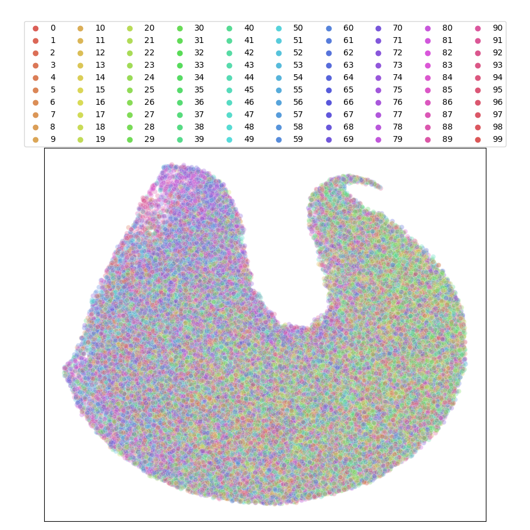
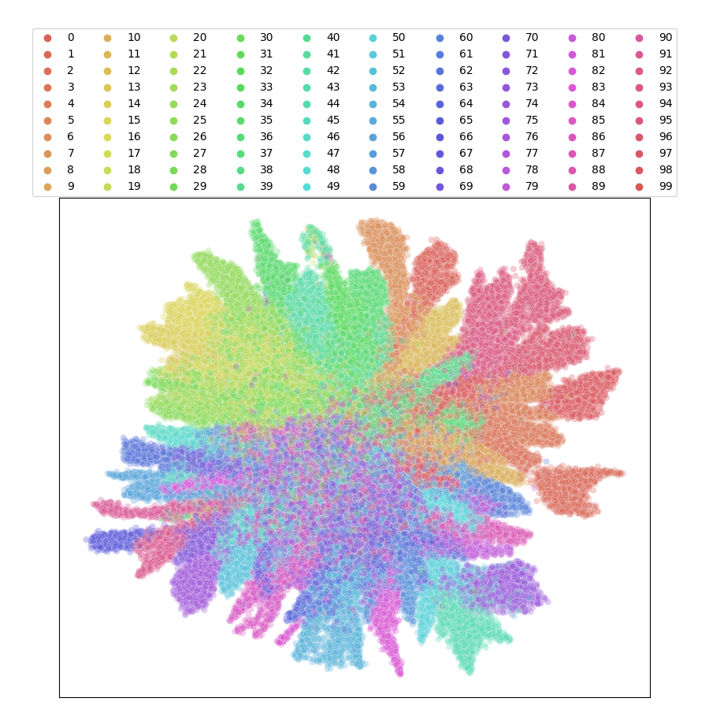
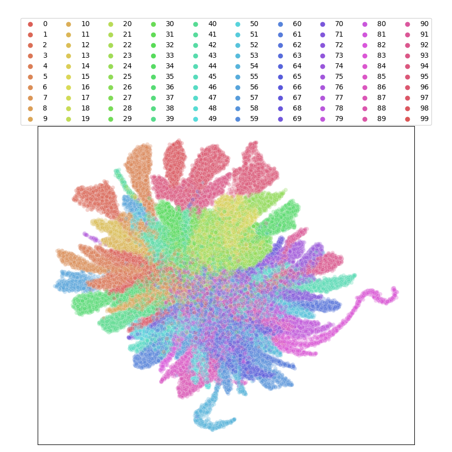
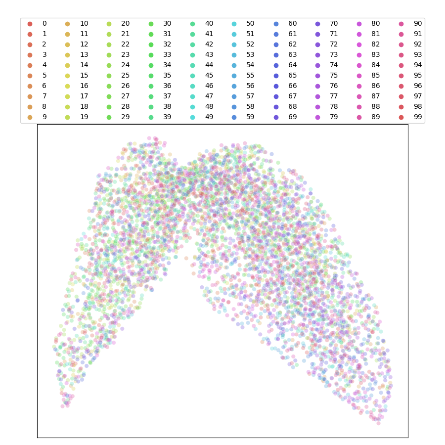
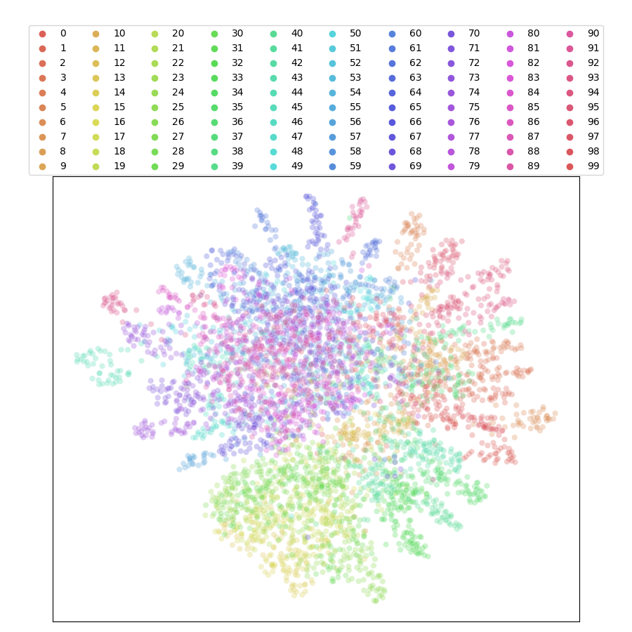
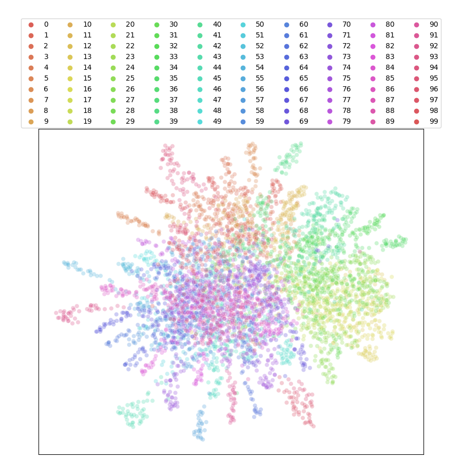

Creating visualizations of the features produced by your method (before, after or even during training) is super straightforward!

Let's suppose that you have already pretrained your model and it's saved as `checkpoint.ckpt`.
You can then create a new file by reusing parts of `main_linear.py` to first load your checkpoint:

.. code-block:: python

    import torch
    import torch.nn as nn
    from torchvision.models import resnet18, resnet50

    from solo.utils.backbones import (
        swin_base,
        swin_large,
        swin_small,
        swin_tiny,
        vit_base,
        vit_large,
        vit_small,
        vit_tiny,
    )

    from solo.utils.classification_dataloader import prepare_data

    # change this if you wanna load a different model
    my_backbone = "resnet18"

    backbone_model = {
        "resnet18": resnet18,
        "resnet50": resnet50,
        "vit_tiny": vit_tiny,
        "vit_small": vit_small,
        "vit_base": vit_base,
        "vit_large": vit_large,
        "swin_tiny": swin_tiny,
        "swin_small": swin_small,
        "swin_base": swin_base,
        "swin_large": swin_large,
    }[my_backbone]

    # initialize backbone
    kwargs = {
        "cifar": False,  # <-- change this if you are running on cifar
        # "img_size": 224,  # <-- uncomment this when using vit/swin
        # "patch_size": 16,  # <-- uncomment this when using vit
    }
    cifar = kwargs.pop("cifar", False)
    # swin specific
    if "swin" in my_backbone and cifar:
        kwargs["window_size"] = 4

    model = backbone_model(**kwargs)
    if "resnet" in my_backbone:
        # remove fc layer
        model.fc = nn.Identity()
        if cifar:
            model.conv1 = nn.Conv2d(3, 64, kernel_size=3, stride=1, padding=2, bias=False)
            model.maxpool = nn.Identity()

    ckpt_path = "checkpoint.ckpt"

    state = torch.load(ckpt_path)["state_dict"]
    for k in list(state.keys()):
        if "backbone" in k:
            state[k.replace("backbone.", "")] = state[k]
        del state[k]
    model.load_state_dict(state, strict=False)

    print(f"loaded {ckpt_path}")

Then, you create a dataloader for your data:

.. code-block:: python

    train, val_loader = prepare_data(
        "imagenet100",
        data_dir="/datasets",
        train_dir="imagenet-100/train",
        val_dir="imagenet-100/val",
        batch_size=64,
        num_workers=4,
    )

Finally, you import the offline umap class and creates a visualization:

.. code-block:: python

    from solo.utils.auto_umap import OfflineUMAP

    umap = OfflineUMAP()

    # move model to the gpu
    device = "cuda:0"
    model = model.to(device)

    umap.plot(device, model, train_loader, 'im100_train_umap.pdf')
    umap.plot(device, model, val_loader, 'im100_val_umap.pdf')

And that's it!
For example, here are some cool examples of UMAPs for Imagenet-100 with a random ResNet18 versus our Barlow Twins and BYOL pretrained models.

Imagenet-100 Train: Random, Barlow Twins, BYOL

|random-im100-train| |barlow-im100-train| |byol-im100-train|

Imagenet-100 Validation: Random, Barlow Twins, BYOL

|random-im100-val| |barlow-im100-val| |byol-im100-val|

For online UMAPs of your data, you simply need to add the flag :code:`--auto_umap` and you are done!
Don't forget that this makes training muc slower since the UMAPs are produced after each epoch.

Note that the same can be accomplished by running the following bash file.

.. code-block:: bash
    python3 ../../../main_umap.py \
        --dataset imagenet100 \
        --data_dir /datasets \
        --train_dir imagenet-100/train \
        --val_dir imagenet-100/val \
        --batch_size 16 \
        --num_workers 10 \
        --pretrained_checkpoint_dir PATH_TO_PRETRAINED_MODEL_DIR
